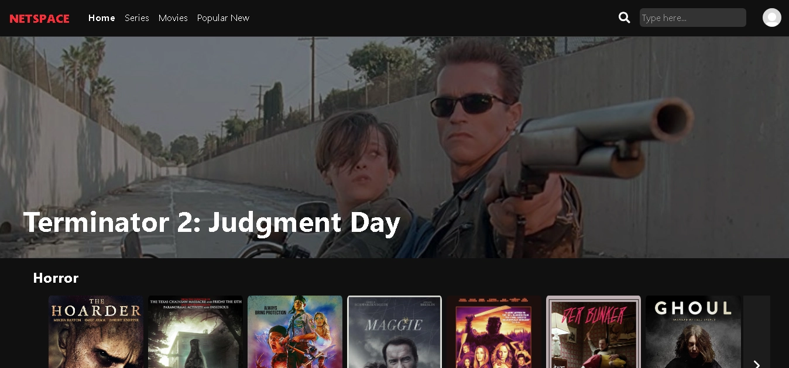
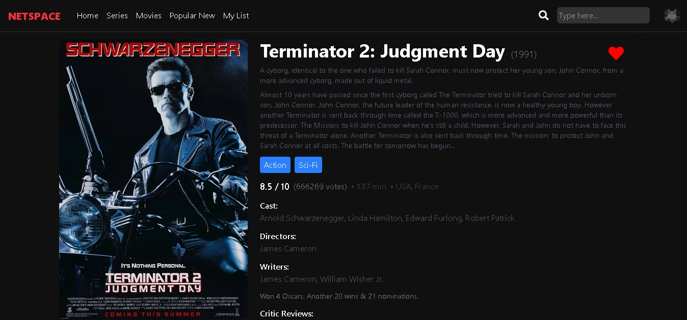
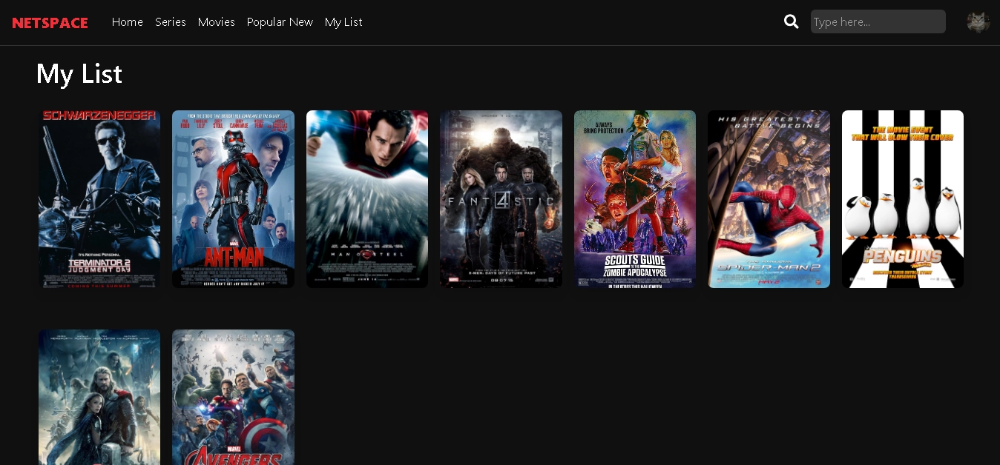

# 🎬 Netspace - Aplicación de Películas MERN

  

**Netspace** es una aplicación web full-stack diseñada para la exploración y gestión de películas. Desarrollada con el stack **MERN** (MongoDB, Express, React, Node.js), este proyecto nace con el objetivo de consolidar habilidades avanzadas en desarrollo web, creación de APIs y bases de datos, ofreciendo una experiencia de usuario moderna y estilizada con **Tailwind CSS**.

---

## ✨ Funcionalidades

### 🎥 Experiencia de Usuario
* **Exploración de Películas:** Navegación fluida a través de una amplia biblioteca de títulos.
* **Buscador Integrado:** Funcionalidad de búsqueda para encontrar películas específicas rápidamente.
* **Detalles Completos:** Vistas detalladas con sinopsis, elenco (cast) y calificaciones.
* **Lista de Favoritos:** Sistema de "Me gusta" (❤️) que guarda películas y series en una colección personal persistente.

### 🔐 Usuarios y Seguridad
* **Autenticación Segura:** Registro e inicio de sesión gestionados mediante **JWT (JSON Web Tokens)**.
* **Verificación por Email:** Sistema de validación de cuentas mediante envío de correos electrónicos al registrarse.
* **Protección de Datos:** Las contraseñas se almacenan encriptadas utilizando hashing (bcrypt).
* **Perfil Personalizable:** Los usuarios pueden subir foto de perfil, editar su nombre y seleccionar sus géneros favoritos.

---

## 🛠️ Tecnologías Utilizadas

Este proyecto utiliza una arquitectura **MERN**:

* **Frontend:** React.js, Tailwind CSS (Estilos).
* **Backend:** Node.js, Express.js.
* **Base de Datos:** MongoDB (Base de datos NoSQL escalable).
* **Autenticación:** JWT, Bcrypt.
* **Otros:** Nodemailer (para correos), Mongoose (ODM).